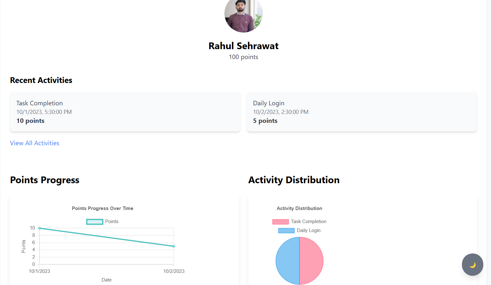
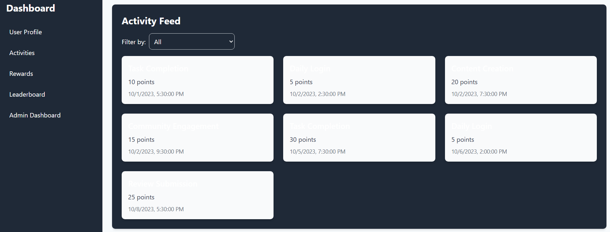
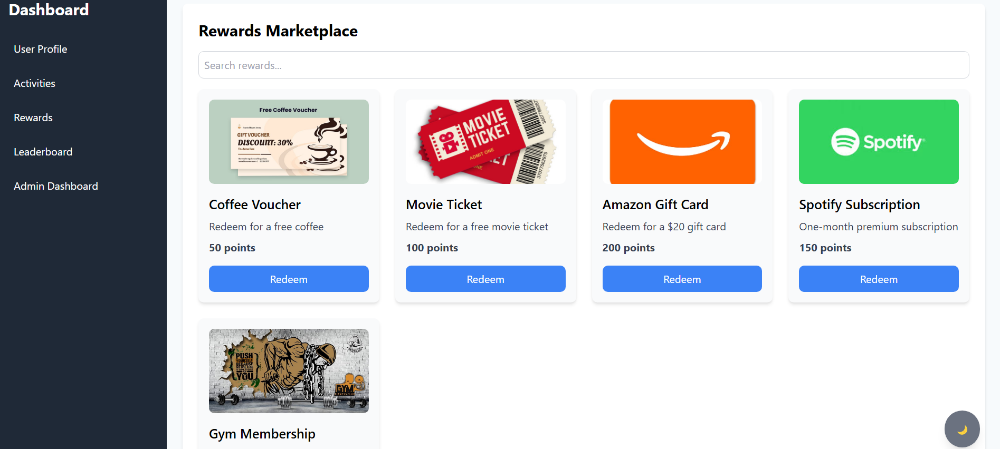
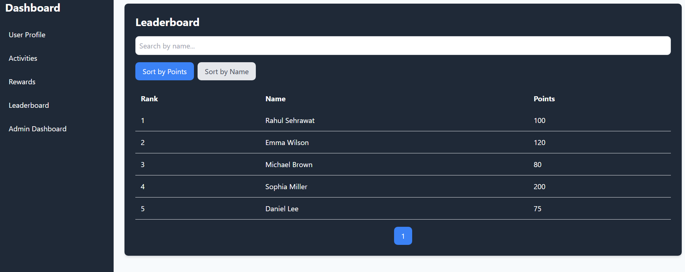
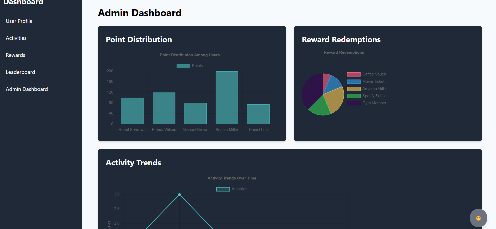

# Reward System Dashboard

A comprehensive rewards management dashboard application built with React, Redux, and Tailwind CSS.

## Features
- **User Management**: Display user profiles and track points.
- **Activity Management**: Log and view point-earning activities.
- **Rewards Marketplace**: Browse and redeem rewards.
- **Leaderboard**: View top point earners.
- **Admin Dashboard**: Manage users, rewards, and activities.

## Setup
1. Clone the repository:
   ```bash
   git clone https://github.com/Rahul-sehrawat/Reward-System-Dashboard

2. Install dependencies:
    ```bash
    npm install

3. Start the development server:
    ```bash
    npm start

4. Start the mock API server (in a separate terminal):
    ```bash
    REACT_APP_API_BASE_URL=http://localhost:3001


## Environment Variables

Create a .env file in the root of the project and add the following:
    ```bash
    REACT_APP_API_BASE_URL=http://localhost:3001


## Technologies Used
 - React
 - Redux Toolkit
 - Tailwind CSS
 - Chart.js
 - JSON Server (mock API)

## Live Demo
The project is hosted on **Netlify**:
👉 [Live Demo](https://rewardsdashboard.netlify.app/)

### Backend (JSON Server)
The mock backend is hosted separately to fetch data on render

##Screenshots

### User Profile
  
*Displays user details, points, and activity/reward summaries.*

### Activities Feed
  
*Shows a list of recent activities with filtering options.*

### Rewards Marketplace
  
*Allows users to browse and redeem rewards.*

### Leaderboard
  
*Displays top users based on points.*

### Admin Dashboard
  


## Future Scope

Here are some advanced features and improvements planned for the future:

1. Authentication and Role-Based Access
2. Advanced Admin Features
3. Enhanced Analytics

## Contributing

Contributions are welcome! If you'd like to contribute, please follow these steps:

1. Fork the repository.
2. Create a new branch (git checkout -b feature/YourFeatureName).
3. Commit your changes (git commit -m 'Add some feature').
4. Push to the branch (git push origin feature/YourFeatureName).
5. Open a pull request.

